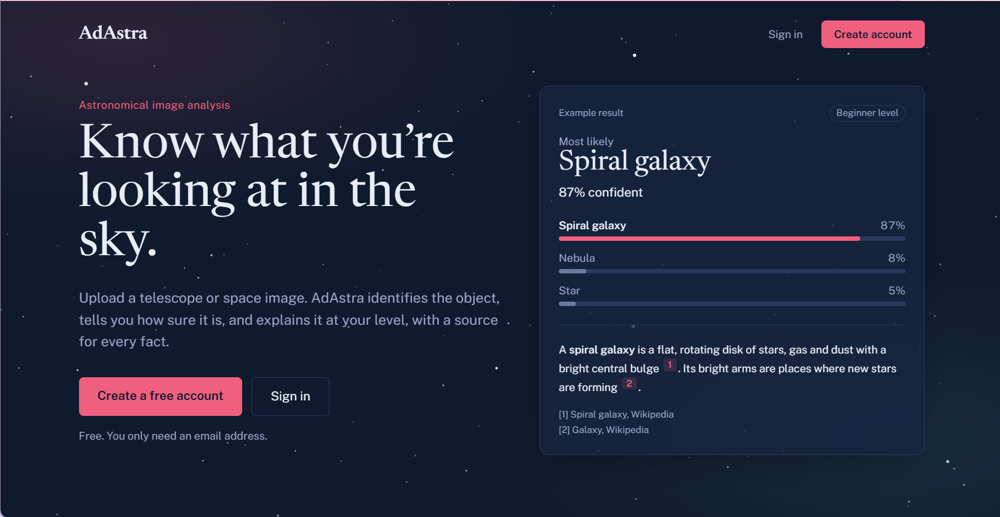
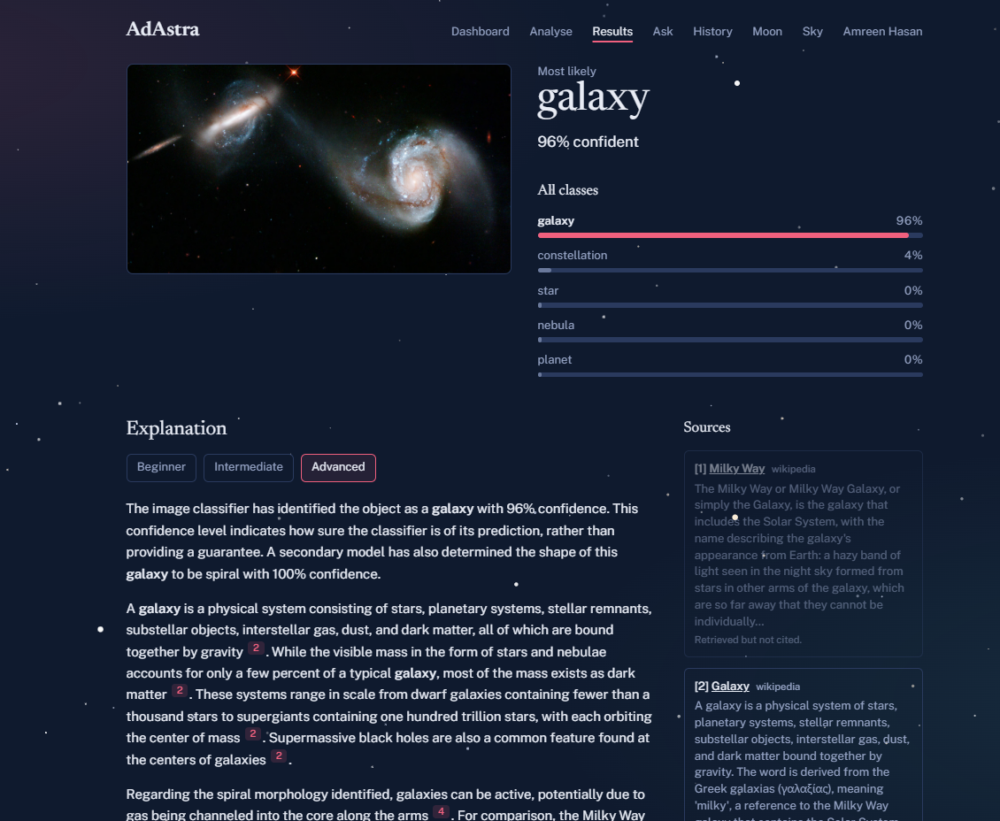
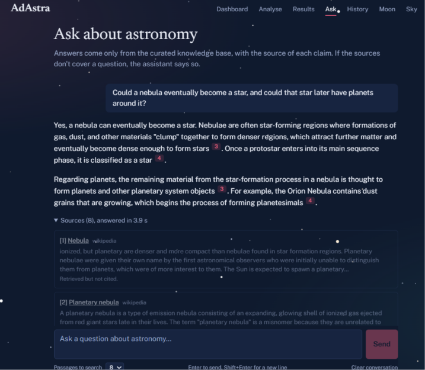
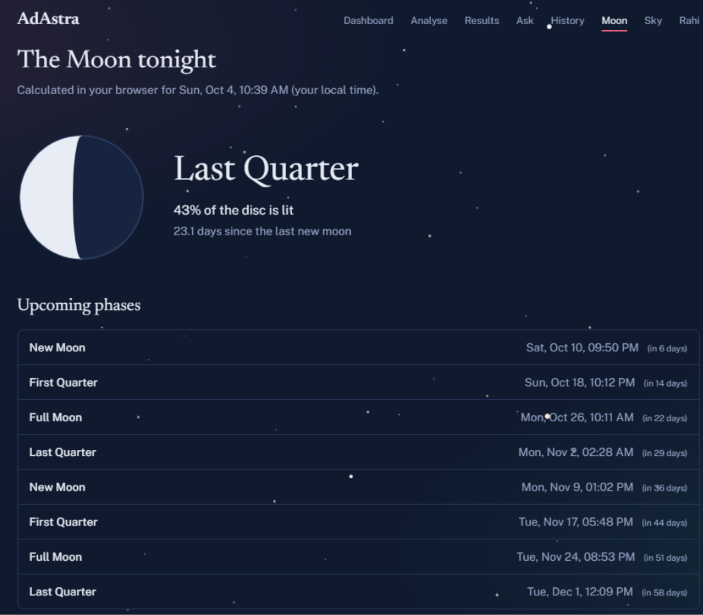
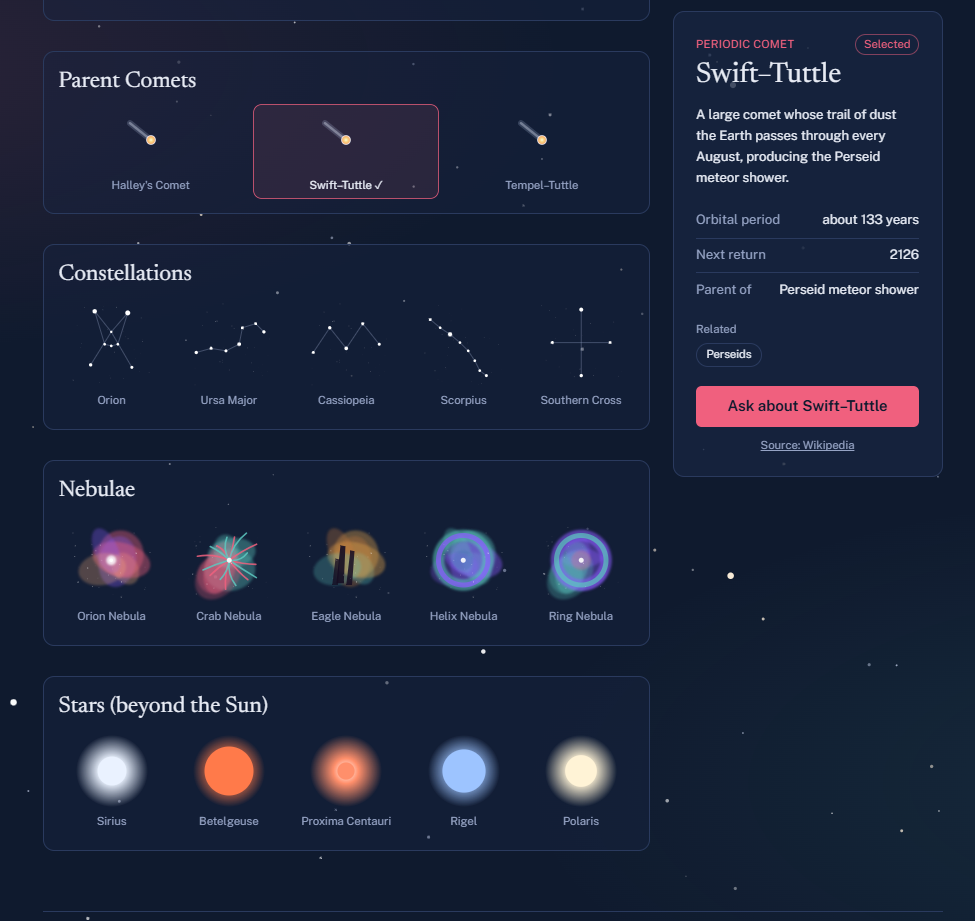
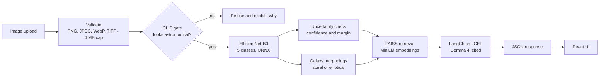

<div align="center">

# ᯓ★ AdAstra ⋆˚꩜｡

### Know what you're looking at in the sky.

⋆˚꩜｡.✦ ݁˖.

**A web platform for astronomical image detection, object classification, and knowledge retrieval.**

Upload a space image → get the object type, an honest confidence, and a cited explanation at your reading level.

[**Live demo**](https://adastra-virid.vercel.app) · [Architecture](#architecture) · [Results](#results) · [Run locally](#run-it-locally) · [Limitations](#honest-limitations)


[](https://adastra-virid.vercel.app)




</div>

---

## Why this exists

Sky surveys produce far more images than people can inspect by hand. Deep learning can label them, but a bare *"galaxy, 96%"* teaches the user nothing and gives them no way to judge whether to trust it.

AdAstra closes that gap. It pairs a lightweight CNN classifier with a retrieval-augmented explanation layer, so every prediction comes with **what it means, how sure the system is, and where each fact came from**. It is also built to say *"I'm not sure"* and *"this isn't a space image"* instead of confidently guessing.

> Completed as a two-person BRAC University CSE 400 undergraduate thesis. Designed to be defensible in a viva: every number in the UI traces back to a config value or a model manifest.

## What it does

| | |
|---|---|
| ⋆˚꩜｡ **Classify** | EfficientNet-B0 sorts an image into **constellation, galaxy, nebula, planet, or star**, with probabilities for all five classes. |
| ꩜ **Galaxy shape** | If the object is a galaxy, a second EfficientNet-B0 decides **spiral vs. elliptical** (two-stage recognition). |
| ⋆.˚ ☾⭒.˚ **Refuses non-space images** | A **CLIP gate** asks "does this even look astronomical?" before classifying, because a closed-set classifier will happily call a cat photo a "nebula". |
| ⋆⭒˚.⋆ **Flags uncertainty** | If confidence < 0.55 or the top two classes are within 0.15, the result is marked *uncertain*, the runner-up is shown, and the explanation covers both. |
| .✦ ݁˖ **Explains with sources** | Retrieval over a FAISS index of Wikipedia astronomy articles feeds **Gemma 4** via LangChain. Output is cited `[n]`, in **beginner / intermediate / advanced** levels. |
| ✨ **Ask anything** | A free-form astronomy assistant answering **only** from the knowledge base, and saying so when the sources don't cover the question. |
| ⋆☀︎. **Moon + Sky** | A browser-side Moon-phase calculator and an interactive celestial-object explorer that hands off to the assistant. |
| ꒷꒦︶꒷꒦︶ ๋ ࣭ ⭑꒷꒦ **Accounts and history** | Firebase Auth (email verification, password reset, account deletion) with analysis history in MongoDB Atlas, plus printable reports. |

## Screenshots

### Classification with a cited, level-adjustable explanation
Probabilities for all five classes, a second-stage morphology result, and an explanation whose `[n]` chips link to the retrieved sources. Passages that were retrieved but not used are dimmed and labelled *"Retrieved but not cited"*.



### Ask about astronomy
Answers come only from the curated knowledge base. The user chooses how many passages to search, and each claim is attributed to a numbered source.



<table>
<tr>
<td width="50%" valign="top">

### Moon phases
Computed in the browser using Meeus' *Astronomical Algorithms* (ch. 48-49). Phase times were cross-checked against PyEphem and agree to about two minutes.



</td>
<td width="50%" valign="top">

### Sky explorer
Browse comets, constellations, nebulae, and stars. Pick an object to see key facts and jump straight into the assistant with a pre-filled question.



</td>
</tr>
</table>

## Architecture



**Two Vercel projects, one repository.** The React frontend is static; the FastAPI backend runs as a serverless function. The frontend calls the backend directly over CORS.

### Engineering decisions worth noting

- **Train in PyTorch, serve with ONNX Runtime.** All three models (classifier, morphology, CLIP) run on ONNX Runtime, so the deployed backend ships *no* PyTorch. This keeps the bundle inside Vercel Hobby's 500 MB limit and cold starts short. The CLIP vision tower was dynamically int8-quantised from **351.6 MB to 88.6 MB**; the ONNX export matches PyTorch to ~5e-7 max difference, and the gate decision was verified identical to fp32.
- **Manifest-driven models.** Class names, preprocessing, normalisation, and a sha256 checksum live in each model's `manifest.json`. The server verifies the checksum before loading, so train-time and serve-time preprocessing cannot silently drift apart.
- **Honest degradation.** Every model has a clearly labelled demo fallback. A missing artifact never crashes the site and never passes a placeholder off as a real result; every response carries `mode: live | demo` and a `warnings` list.
- **Non-blocking API.** Handlers are plain `def`, so FastAPI runs them in a threadpool and a slow inference never blocks health checks or other users.
- **Real LCEL, not a script.** Retrieval sits *inside* the LangChain chain. Retry logic only retries rate-limit (429/503) errors, with bounded attempts and a timeout, instead of retrying everything.
- **Grounded generation.** The prompt restricts Gemma to retrieved passages and requires `[n]` citations. A post-processor strips any citation number that doesn't match a returned source and warns if a response cites nothing.
- **Reasoning budget tuned for latency.** Default Gemma reasoning consumed 4,000+ hidden tokens and hit a 90 s gateway timeout (HTTP 504); setting minimal reasoning fixed it.
- **Client-side downscaling** keeps uploads under Vercel's 4.5 MB request-body limit.

## Results

All three candidate CNNs (ResNet18, ResNet50, EfficientNet-B0) were fine-tuned from ImageNet with the same splits and settings (AdamW, lr 1e-4, 30 epochs, mixed precision, flip/rotation augmentation).

| Task | Dataset | Classes | Test images | EfficientNet-B0 accuracy |
|---|---|---|---|---|
| Object classification | SpaceNet | 5 | 2,019 | **83.66%** (macro-F1 0.836) |
| Galaxy morphology | Galaxy Zoo | 2 | 9,237 | **86.25%** (macro-F1 0.858) |

Per-class recall on SpaceNet: planet 0.92, galaxy 0.87, star 0.82, nebula 0.82, constellation 0.74.

**Why EfficientNet-B0 when accuracy was a statistical tie?** Differences between the three models were not significant (two-proportion z-tests, all p > 0.05), so the choice was made on cost: ~5.3M parameters and ~0.39 GFLOPs, a 16 MB checkpoint, and the smallest generalisation gap on Galaxy Zoo (0.9 points vs 5.7 for ResNet50). It fits a free-tier serverless host. In practice the LLM dominates latency (~8.5 s of an ~8.8 s analysis; decode, CLIP, classification and morphology together take ~0.28 s), which supports using a small classifier.

**Knowledge base:** 113 Wikipedia astronomy articles, split into 6,222 overlapping chunks, embedded with `all-MiniLM-L6-v2` (384-d) and searched with an exact FAISS inner-product index over normalised vectors (cosine similarity).

## Tech stack

| Layer | Technology |
|---|---|
| Frontend | React 19, TypeScript, Vite, Tailwind CSS v4, React Router, Vitest |
| Backend | FastAPI, Pydantic v2, Python 3.12 |
| Vision | EfficientNet-B0 ×2 and CLIP ViT-B/32 (int8), all on ONNX Runtime |
| Retrieval | fastembed (MiniLM), FAISS `IndexFlatIP`, custom retriever |
| LLM | Gemma 4 (`gemma-4-26b-a4b-it`) via Google AI Studio, LangChain LCEL |
| Auth and data | Firebase Auth, MongoDB Atlas |
| Hosting | Vercel (two projects, one repo) |

## Project structure

```
.
├── backend/
│   ├── main.py                 # FastAPI app and routes
│   ├── adastra/
│   │   ├── pipeline.py         # orchestrates the stages
│   │   ├── classify.py         # classifier + uncertainty logic
│   │   ├── morphology.py       # spiral / elliptical model
│   │   ├── clip.py             # astronomy gate
│   │   ├── imaging.py          # validation and preprocessing
│   │   ├── onnx_runtime.py     # model loading + checksum verification
│   │   ├── demo.py             # deterministic, labelled fallbacks
│   │   └── rag/                # embedder, FAISS store, retriever, LLM, chains, citations
│   ├── artifacts/              # ONNX models + manifests + FAISS index
│   ├── scripts/                # knowledge ingestion and diagnostics
│   └── tests/                  # run with no model, API key, or network
├── frontend/src/               # pages, components, lib (API client, Moon maths, downscaler)
├── knowledge/                  # Wikipedia topic list
└── docs/screenshots/
```

## API

| Method | Path | Purpose |
|---|---|---|
| `GET` | `/api/health` | Per-slot status (live / missing / invalid), model summary, LLM status |
| `POST` | `/api/classify` | Multipart image → CLIP gate, classification, morphology, cited explanation, sources |
| `POST` | `/api/explain` | Re-explain an earlier result at a different level (stateless) |
| `POST` | `/api/rag-query` | Free-form question → cited answer |
| `GET/POST/DELETE` | `/api/me`, `/api/history` | Profile and analysis history (signed-in users) |

OpenAPI docs are served by FastAPI when running locally.

## Run it locally

**Prerequisites:** Python 3.12, Node.js 20+, a free [Google AI Studio](https://aistudio.google.com) key.

```bash
# Backend
cd backend
python -m venv .venv
source .venv/bin/activate          # Windows: .venv\Scripts\activate
pip install -r requirements.txt
cp .env.example .env               # Windows: copy .env.example .env  → then add your keys
uvicorn main:app --reload --port 8000
```

```bash
# Frontend (new terminal)
cd frontend
npm ci
cp .env.example .env.local         # Windows: copy .env.example .env.local
npm run dev                        # http://localhost:5173
```

Key backend variables:

| Variable | Purpose |
|---|---|
| `GOOGLE_API_KEY` | Gemma explanations and the Ask page (placeholder text without it) |
| `GEMMA_MODEL` | Defaults to `gemma-4-26b-a4b-it` |
| `CORS_ORIGINS` | Allowed frontend origin(s) |
| `FIREBASE_PROJECT_ID` | Enables sign-in (leave empty for open local testing) |
| `MONGODB_URI`, `MONGODB_DB` | Accounts and history |
| `MIN_CONFIDENCE`, `MIN_MARGIN` | Uncertainty thresholds (defaults 0.55 / 0.15) |

Never commit `.env` files. To rebuild or extend the knowledge base:

```bash
python -m scripts.ingest --wikipedia --pdfs     # first build
python -m scripts.ingest --pdfs --append        # add more PDFs later (never overwrites without --rebuild)
python -m scripts.search "how do spiral galaxies form"
```

### Tests

```bash
cd backend  && pytest -q       # no model weights, API key, or internet required
cd frontend && npm test
```

## Honest limitations

A project that explains its own failure modes is more useful than one that hides them.

- **Explanation is not verification.** RAG explains the *predicted* class. If the CNN is wrong, the explanation will be fluent, sourced, and about the wrong object. The CLIP gate and uncertainty check reduce this but do not remove it.
- **Closed-set classifier.** It always picks one of five classes. Visually similar classes (constellation / star / nebula) account for most errors; 72.7% of SpaceNet mistakes involve the star class.
- **Uncertainty thresholds are hand-set**, not tuned on held-out data, and calibration (ECE, temperature scaling) was not measured.
- **SpaceNet has no separate validation split**, so the best checkpoint was selected on the test set and its score is slightly optimistic. Galaxy Zoo does not have this problem.
- **Single training run per model**, so the "statistical tie" claim rests on binomial tests rather than multi-seed variance.
- **Knowledge base is Wikipedia only** for now. Peer-reviewed papers and textbooks are planned.
- **Not evaluated:** explanation quality has not yet been measured quantitatively or with a user study.

## Roadmap

- Grad-CAM heatmaps (explain *which pixels* drove the decision, not just what the class means)
- Class-weighted / focal loss and multi-seed or k-fold evaluation; per-image predictions for McNemar's test
- Calibration measurement and threshold tuning on a proper validation set
- Papers and textbooks in the knowledge base
- FITS / multiband support and batch upload for classrooms

## Acknowledgements

SpaceNet (Kaggle) and Galaxy Zoo volunteers for the data; Wikipedia contributors (CC BY-SA) for the knowledge base; OpenAI CLIP; the EfficientNet, ONNX Runtime, FAISS, LangChain, and fastembed projects.

## Authors

A two-person BRAC University CSE 400 thesis project.

| | Contribution |
|---|---|
| **Talal Bin Sajjad Rahi** ([@TalalRahi](https://github.com/TalalRahi)) | Project lead and copyright holder; platform architecture, backend and frontend engineering, deployment |
| **Amreen Hassan** ([@amreenhassan13](https://github.com/amreenhassan13)) | Training and running the classification models (EfficientNet-B0 on SpaceNet and Galaxy Zoo); RAG implementation — knowledge base, retrieval and grounded explanations; Sky page features; thesis report |

Original repository: [TalalRahi/AdAstra](https://github.com/TalalRahi/AdAstra)

## License

View-only. The source may be read for personal and educational purposes; copying, redistribution, and reuse require written permission. See [LICENSE](LICENSE).
